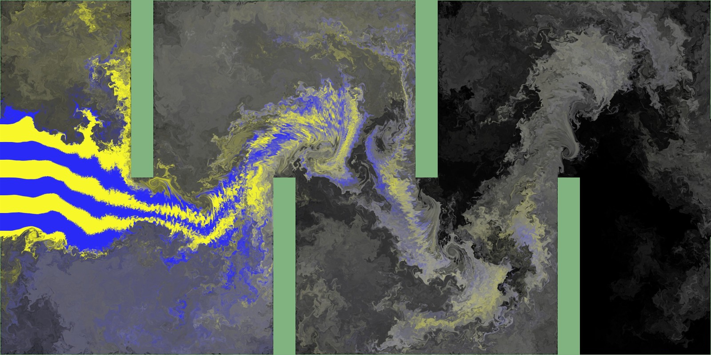
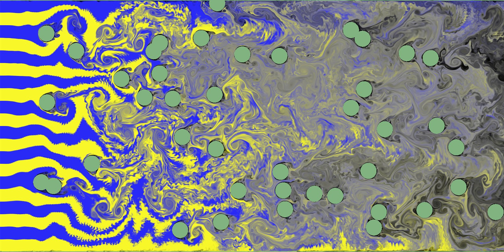

# 2D Fluid Simulator




## Features

- Finite Difference Method (MAC Method)
- Advection Scheme
  - Upwind Differencing
  - Kawamura-Kuwahara
  - CIP (Constrained Interpolation Profile)
- Flow Visualization
  - Norm (Velocity) and Pressure
  - Pressure
  - Vorticity
  - Dye
- Vorticity Confinement

## Setup

Run the following command in an environment with the uv project management tool installed:

```bash
uv sync
```

GeForce GTX 1080 or higher recommended.

## Usage

- Boundary Condition 1, ReynoldsNumber = 1000, dt = 0.0005, VorticityConfinement is Disable
  ```bash
  uv run main.py -re 1000 -dt 0.0005 -vc 0.0
  ```
  Press `V` key switches the flow visualization method.
  `dt` is automatically determined even if not specified, but should be small for divergence.
- Boundary Condition 2, resolution = 800
  ```bash
  uv run main.py -bc 2 -res 800
  ```
  Boundary conditions can be specified from 1 to 6
- Boundary Condition 3, ReynoldsNumber = 10^8, resolution = 800, VorticityConfinement = 10
  ```bash
  uv run main.py -bc 3 -re 100000000 -res 800 -vc 10
  ```
- Help
  ```bash
  uv run main.py -h
  ```
- for CPU
  ```bash
  uv run main.py -dt 0.0005 -cpu
  ```

## Screenshots

### Flow Visualization

- Norm and Pressure
  
- Pressure
  
- Vorticity
  
- Dye
  

### Vorticity Confinement

- Disable
  
- Enable
  

## References

- [移流法](https://pbcglab.jp/cgi-bin/wiki/index.php?%E7%A7%BB%E6%B5%81%E6%B3%95)
- [2 次元 CIP 法による移流項の計算](https://i-ric.org/yasu/nbook2/04_Chapt04.html#cip)
- [GPU Gems Chapter 38. Fast Fluid Dynamics Simulation on the GPU
  ](https://developer.nvidia.com/gpugems/gpugems/part-vi-beyond-triangles/chapter-38-fast-fluid-dynamics-simulation-gpu)
- [Ronald Fedkiw, Jos Stam, Henrik Wann Jensen. Visual Simulation of Smoke.](https://web.stanford.edu/class/cs237d/smoke.pdf)
