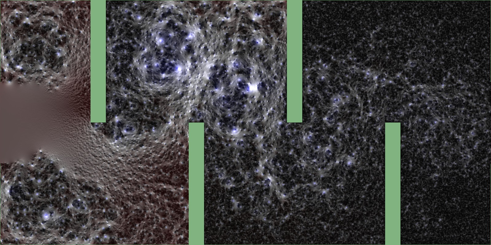
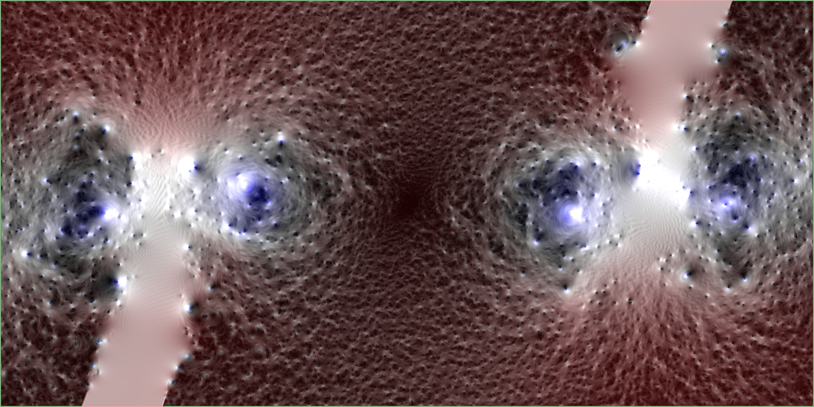
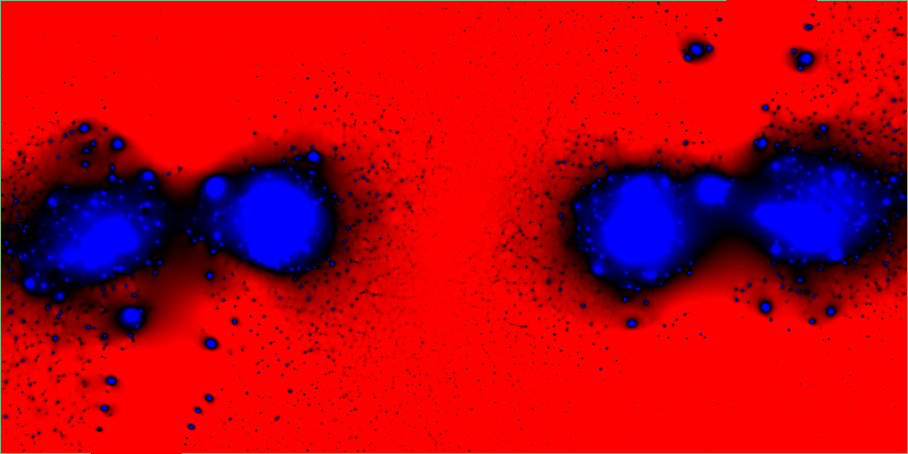
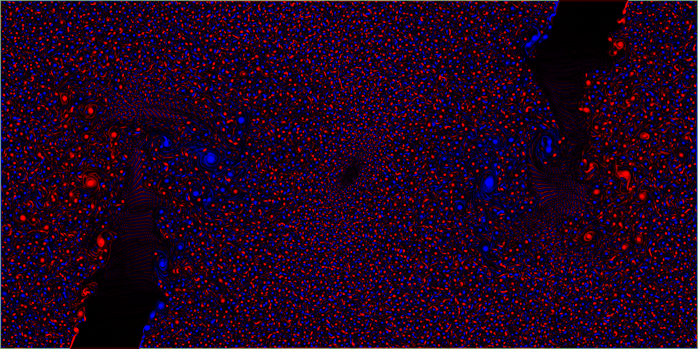
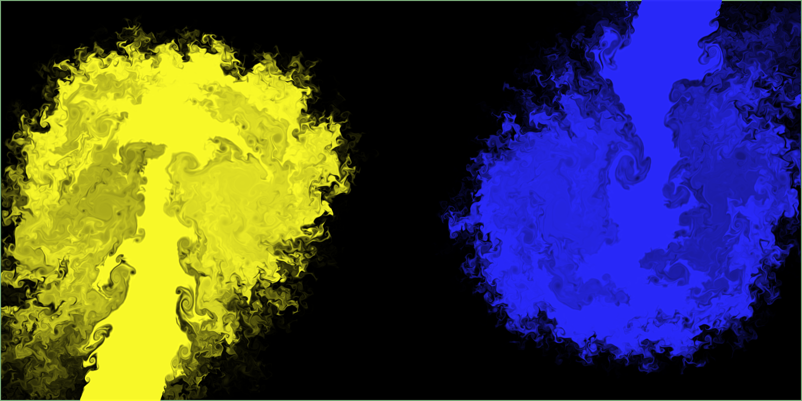
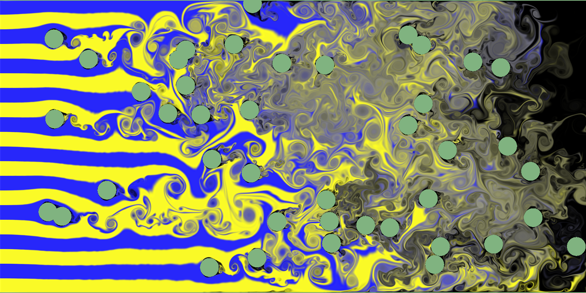
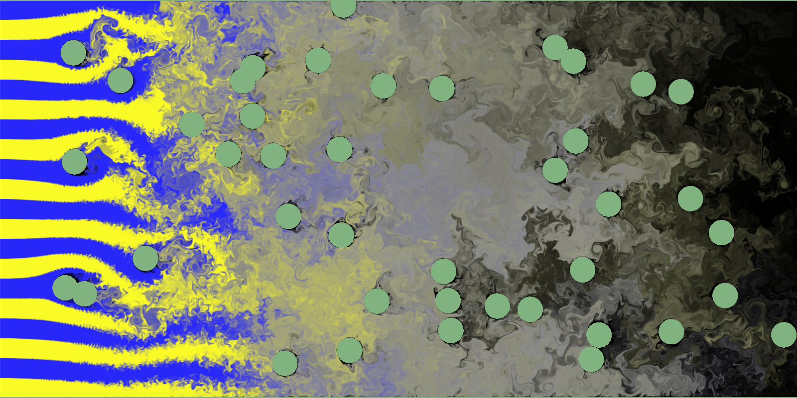

# 2D Fluid Simulator




## Features

- Finite Difference Method (MAC Method)
- Advection Scheme
  - Upwind Differencing
  - Kawamura-Kuwahara
  - CIP (Constrained Interpolation Profile)
- Flow Visualization
  - Norm (Velocity) and Pressure
  - Pressure
  - Vorticity
  - Dye
- Vorticity Confinement

## Requirements

- Python 3.9
- Taichi 1.0

GeForce GTX 1080 or higher recommended.

## Usage

```bash
python main.py -re 0.5  # Boundary Condition 1, Reynolds Number = 0.5, dt = 0.01
```

Press the v key switches the flow visualization method.

```bash
python main.py -bc 2 -re 100 -res 800  # Boundary Condition 2, Reynolds Number = 100.0, dt = 0.01
python main.py -bc 3 -re 100 -res 800 -vor_eps 0.0 -scheme kk  # Boundary Condition 3, Reynolds Number = 100.0, dt = 0.01, Kawamura-Kuwahara Scheme, no vorticity confinement
python main.py -bc 4 -re 100  # Boundary Condition 4, Reynolds Number = 100.0, dt = 0.01
python main.py -h  # help
```

## Screenshots

### Flow Visualization

- Norm and Pressure
  
- Pressure
  
- Vorticity
  
- Dye
  

### Vorticity Confinement

- eps = 0.0
  
- eps = 1.0
  

## References

- [移流法](http://www.slis.tsukuba.ac.jp/~fujisawa.makoto.fu/cgi-bin/wiki/index.php?%B0%DC%CE%AE%CB%A1)
- [2 次元 CIP 法による移流項の計算](https://i-ric.org/yasu/nbook2/04_Chapt04.html#cip)
- [GPU Gems Chapter 38. Fast Fluid Dynamics Simulation on the GPU
  ](https://developer.nvidia.com/gpugems/gpugems/part-vi-beyond-triangles/chapter-38-fast-fluid-dynamics-simulation-gpu)
- [Ronald Fedkiw, Jos Stam, Henrik Wann Jensen. Visual Simulation of Smoke.](https://web.stanford.edu/class/cs237d/smoke.pdf)
